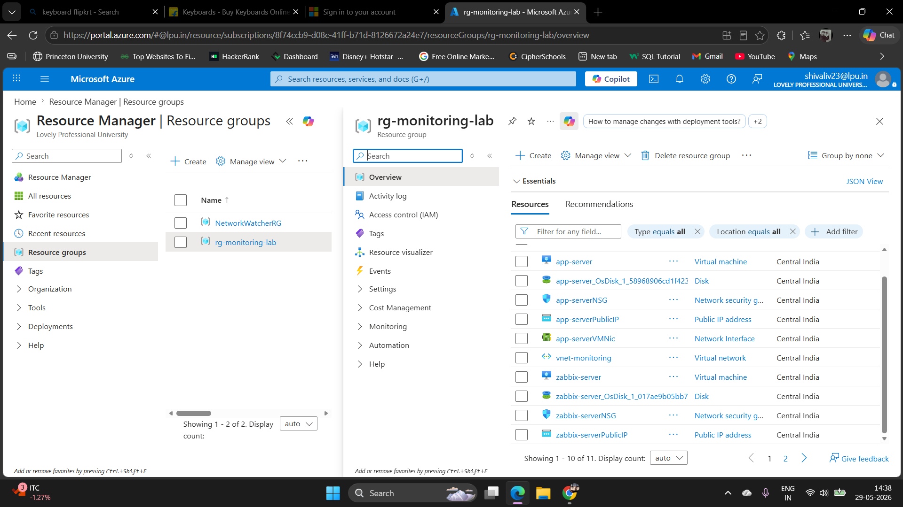
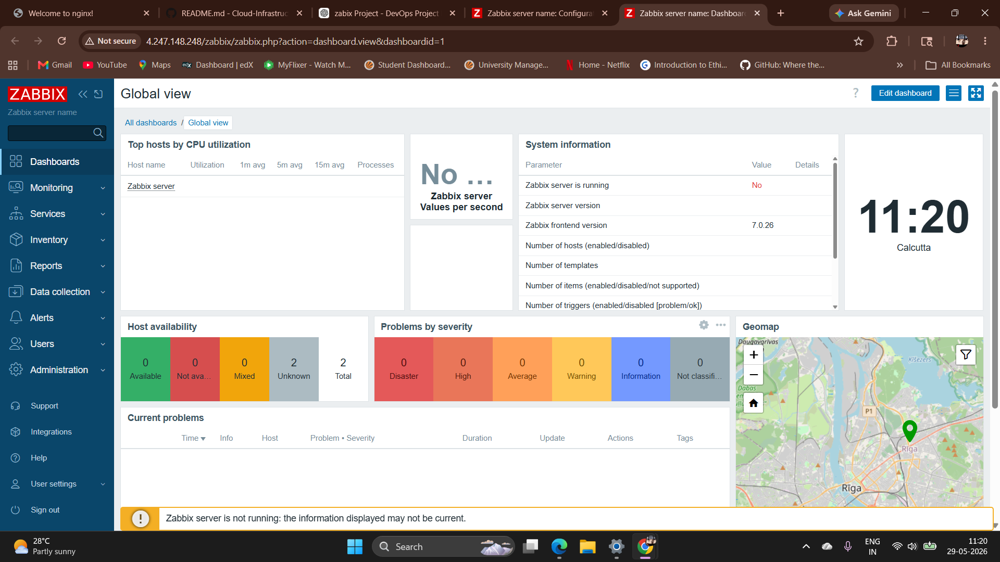
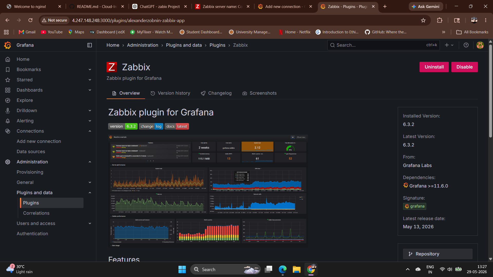
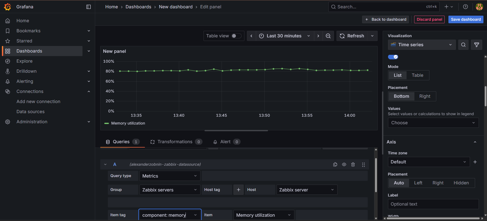

# Cloud Infrastructure Monitoring & Visualization Platform
**Azure | Linux | Docker | Nginx | Zabbix | Grafana | Infrastructure Monitoring | Observability**

---

The platform includes:

- Azure Virtual Machines
- Dockerized Applications
- Nginx Reverse Proxy
- PostgreSQL Database
- Zabbix Monitoring
- Grafana Dashboards
- Alerting via Email/Telegram
- Incident Simulation & Recovery

## Project Principles

Project Overview

This project demonstrates a cloud-based infrastructure monitoring and observability platform deployed on Microsoft Azure.

The primary goal of the project was to monitor server health, collect infrastructure metrics, and visualize system performance in real time using industry-standard monitoring tools.

The platform provides visibility into critical system resources and helps identify infrastructure issues proactively through centralized monitoring dashboards.

## Arc Diagram

## Project Phases

## Phase 1 – Azure Infrastructure Setup

Components
Azure Resource Group
Virtual Network
Network Security Groups (NSG)
Ubuntu Virtual Machine
SSH Access
Implementation

Created an Ubuntu Linux Virtual Machine in Microsoft Azure and configured networking, security rules, and secure remote access through SSH. The VM serves as the central monitoring server hosting all monitoring and visualization components.

### Screenshot

## Phase 2 – Service Deployment & Server Configuration

Components
Ubuntu Linux
Nginx
Linux Service Management
Implementation

Installed and configured Nginx on the Azure Virtual Machine. Configured networking and verified service availability. Prepared the Linux environment for monitoring and observability by managing services and validating server accessibility.

### Screenshot

## Phase 3 – Monitoring Platform Setup

Components
Zabbix Server
Zabbix Agent
Monitoring Templates
Infrastructure Metrics Collection
Implementation

Installed Zabbix Server and Zabbix Agent on the Azure VM. Configured monitoring templates to automatically collect infrastructure metrics from the monitored server.

### Screenshots

Monitored Metrics
CPU Utilization
Memory Utilization
Disk Usage
Network Traffic
System Availability

The Zabbix Agent continuously collects system metrics and sends them to the Zabbix Server for storage, analysis, and monitoring.

## Phase 4 – Visualization & Observability

Components
Grafana
Zabbix Grafana Plugin
Monitoring Dashboards
Implementation

Integrated Grafana with Zabbix using the Zabbix API and Grafana Zabbix Plugin. Created real-time dashboards to visualize infrastructure health and server performance.

### Screenshot

Dashboard Panels
CPU Utilization
Memory Utilization
Disk Usage
Network Traffic

Grafana provides centralized visibility into infrastructure performance and simplifies monitoring and troubleshooting.

## How It Works

Nginx runs on the Azure Virtual Machine.
Zabbix Agent continuously collects infrastructure metrics.
Zabbix Server stores and processes the collected monitoring data.
Grafana connects to Zabbix through the Zabbix API.
Grafana visualizes CPU, memory, disk, and network metrics using dashboards.
Administrators can monitor system health and identify performance issues in real time.

## Technologies Used

Microsoft Azure
Ubuntu Linux
Nginx
Zabbix Server
Zabbix Agent
Grafana
Linux Administration
Infrastructure Monitoring
Observability
Dashboard Metrics
CPU Usage
Memory Usage
Disk Utilization
Network Traffic
System Health Monitoring

## Key Outcomes

Built a cloud-based monitoring and observability platform on Azure.
Implemented infrastructure monitoring using Zabbix Server and Agent.
Integrated Grafana with Zabbix for real-time dashboard visualization.
Monitored critical server resources including CPU, memory, disk, and network usage.
Configured and managed Linux services in a cloud environment.
Gained hands-on experience with cloud infrastructure, monitoring, observability, and DevOps operations.